# Staff Management Application

A comprehensive mobile staff management application integrated with a RAG-based AI Assistant. This project was developed as a **Mobile Programming Course Project** at the **VNU-HCM University of Science (University of Science, VNU-HCM)**.

---

## 📸 App Screenshots & Architecture

### 🏗️ System Architecture & Workflow

Here is the high-level architecture of our Staff Management platform, linking the Android application with Firebase services and the RAG-based AI chatbot server:

<p align="center">
  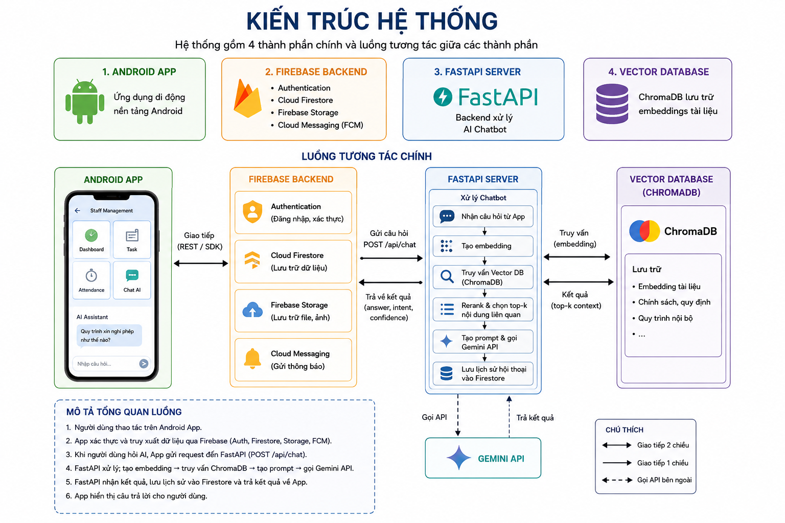
</p>

#### Key Workflows:
* **AI Chatbot flow**:
  <p align="center">
    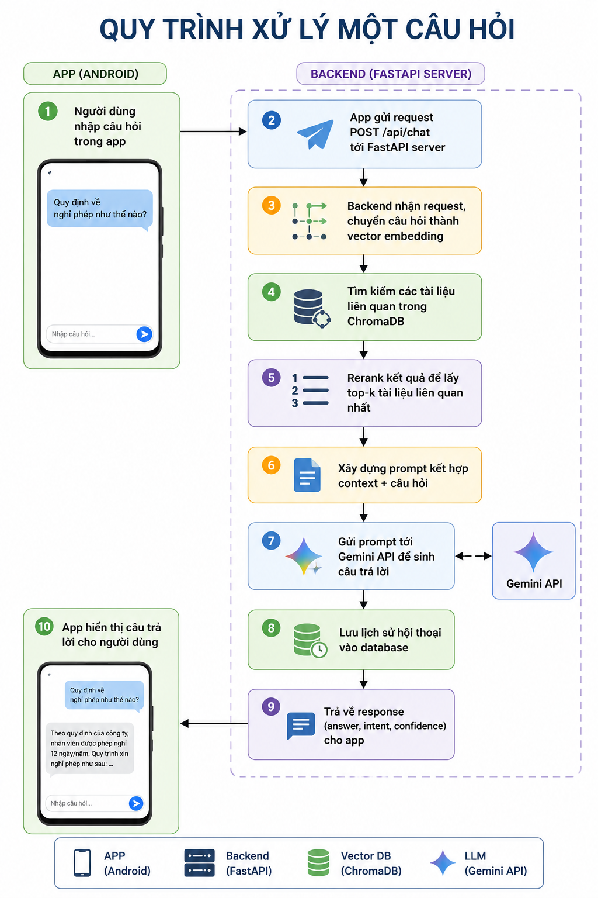
  </p>

* **Role-Based Access Control (RBAC)**:
  <p align="center">
    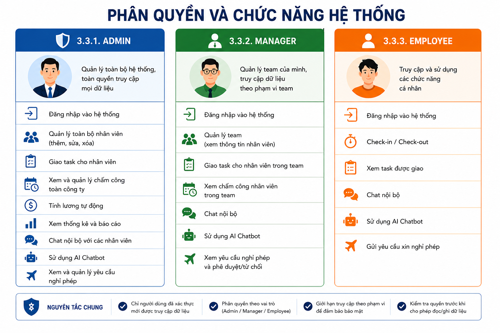
  </p>

---

### 📱 User Interface (UI) Showcase

#### 1. Core Dashboards (Role-Based)

| Admin Dashboard | Manager Dashboard | Employee Dashboard |
| :---: | :---: | :---: |
| 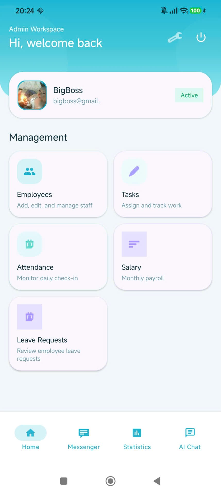 | 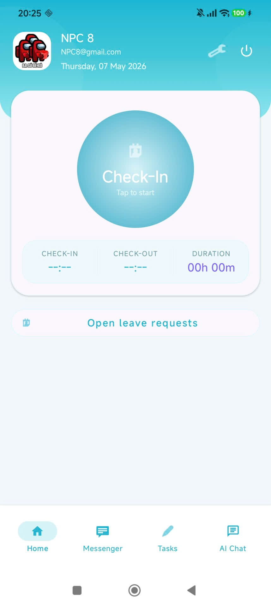 | 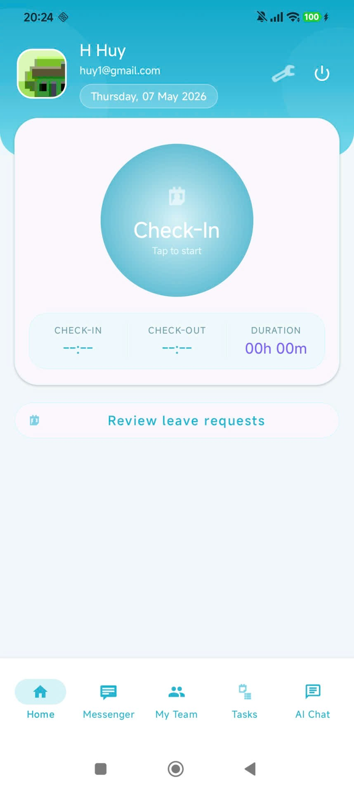 |
| User management, logs, and global permissions | Staff attendance, task assignments, and leaves | Individual check-ins, personal tasks, and chat |

#### 2. Key Features & Tools

| Login & Authentication | Real-time Chat Room | AI Assistant Chat |
| :---: | :---: | :---: |
| 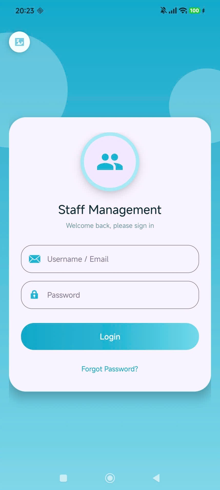 | 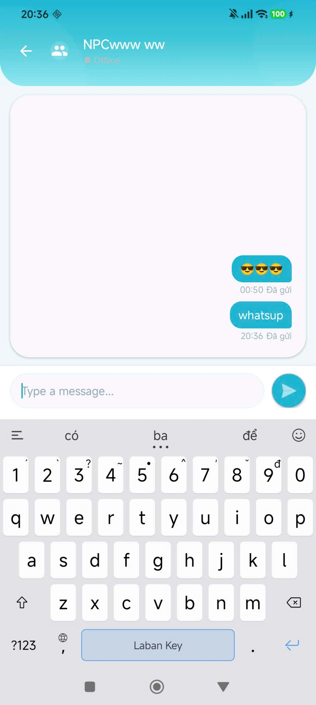 | 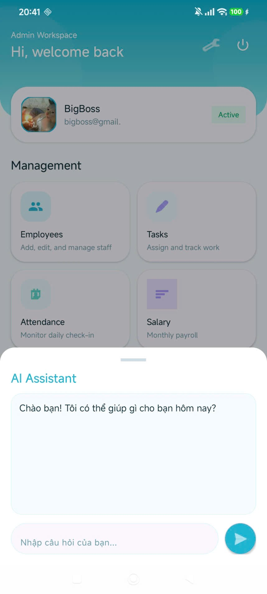 |
| Secure auth via Firebase | Real-time 1-1 & group chats | Quick answers to company policy queries |

| Calendar Attendance | Task Board | Salary & Statistics |
| :---: | :---: | :---: |
| 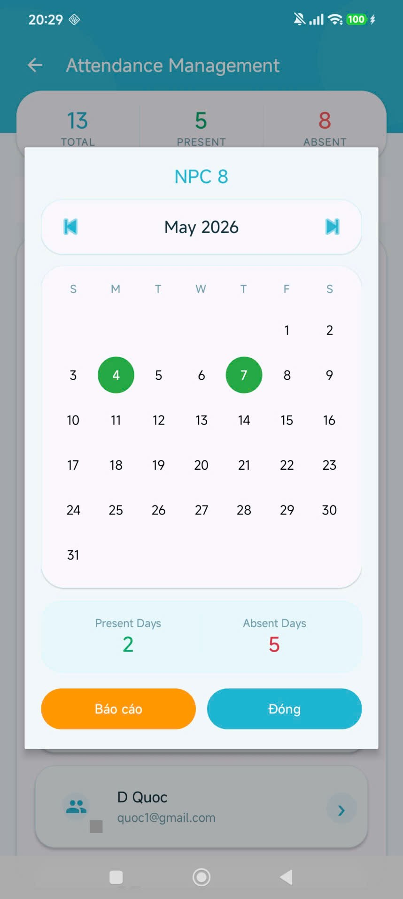 | 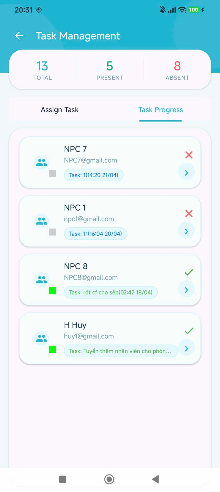 | 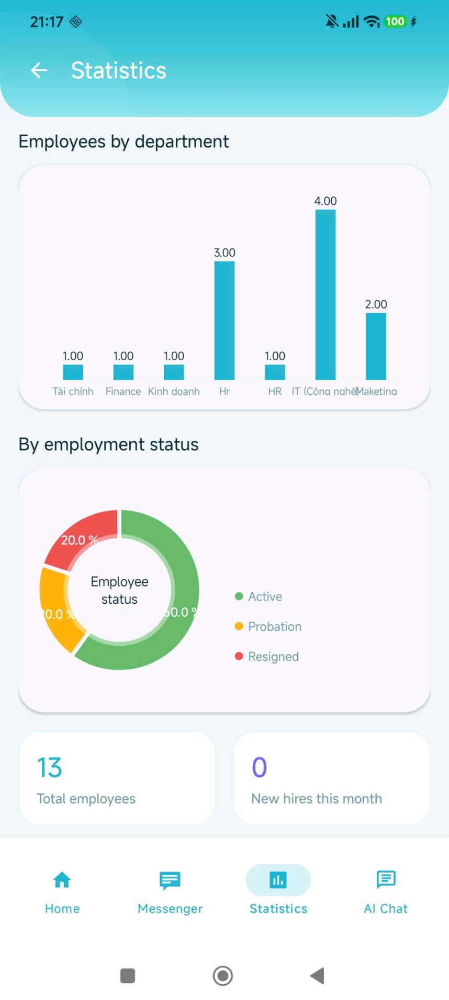 |
| Month-view attendance grid | Progress tracking & assignment | Integrated calculation & distribution charts |

---

## 🤖 AI Chatbot & RAG Backend

The HR AI Chatbot helps answer company policies, salary calculations, and internal guidelines. It utilizes the **Gemini API** coupled with **Retrieval-Augmented Generation (RAG)** to provide accurate answers based on internal documents.

* **RAG Backend Repository**: The RAG system was retrieved and customized from the repository of our team member **Le Tien Thang**: [rag-hr-chatbot](https://github.com/kubbies03/rag-hr-chatbot).
* **Server Note**: Since the RAG backend server is hosted locally (or tunneled via services like ngrok) during development, the AI Chatbot feature in the pre-built app will only respond when the developer's backend server is active. Otherwise, it will return a network timeout/connection error.

---

## 🛠️ Technology Stack

* **Language & IDE**: Java, Android Studio (Gradle).
* **Database & Cloud Services**: Firebase (Authentication, Cloud Firestore, Cloud Storage, Cloud Messaging).
* **Libraries**: OkHttp (REST API client for RAG), Gson (JSON parsing), MPAndroidChart (data visualization), Glide (image loading).

---

## ⚙️ Project Setup & Installation (Post-Clone Guide)

When cloning this repository, you need to manually add the following configuration files and credentials to run the project locally:

### 1. Firebase Configuration
1. Create a project on the [Firebase Console](https://console.firebase.google.com/).
2. Enable **Authentication**, **Cloud Firestore**, **Cloud Storage**, and **Cloud Messaging**.
3. Register an Android application in the Firebase project with the package name: `com.example.staff_management`.
4. Download the `google-services.json` file and place it in the application directory:
   ```text
   Staff-Management-Application/app/google-services.json
   ```

### 2. RAG API Configuration
The API keys and server endpoint details are stored locally.
1. Open (or create) the `local.properties` file in the root directory of the project:
   ```text
   Staff-Management-Application/local.properties
   ```
2. Append the following lines (replace values with your own API endpoints and keys):
   ```properties
   # URL of your RAG API server
   RAG_BASE_URL=https://your-rag-backend-api-url.com
   
   # API authentication token
   RAG_API_KEY=your_rag_api_key_here
   ```

---

## 🔍 Quality Assurance & Testing (QC Showcase)

To align with professional **QC/Tester** standards, a structured testing workflow was implemented during development:

1. **Requirement Analysis**: Outlined data validation limits (e.g., email patterns, password constraints with minimum 6 characters, phone number formats).
2. **Test Design**:
   * Authored 15+ comprehensive test cases covering authentication flows and input validation bounds.
   * Conducted extensive Role-Based Access Control (RBAC) tests to verify that Employee accounts are strictly restricted from accessing Admin/Manager dashboard routes.
3. **Execution & Bug Tracking**:
   * **UI/UX Testing**: Inspected responsive layouts across different screen densities and verified visual feedback matching Material Design.
   * **Boundary Value Analysis (BVA)**: Applied to salary input fields, attendance reports, and user registration forms.
   * **API Testing**: Utilized Postman to test backend RAG endpoints independently prior to integrating them with the Android front-end.

💡 **Portfolio Showcase**: Check out our complete manual test case list and execution status in [TEST_CASES.md](TEST_CASES.md).

---

## 👥 Team & Credits

This project was built collaboratively by:
* **Ha Gia Huy** - Android Developer & QC/Tester: Requirement analysis, Auth, Account Management, Role-Based Access Control (RBAC), and conducted testing for the project (authored & executed 15+ manual test cases to validate authentication stability, input constraints, and role-based navigation).
* **Vo Dinh Quoc** - Android Developer: Employee Management, Attendance, Tasks, Leave Requests, Salary modules, and Cloud Firestore design.
* **Le Tien Thang** - Android Developer: Firebase Storage, FCM integration, real-time Group Chat, Gemini RAG Integration, and reporting.
